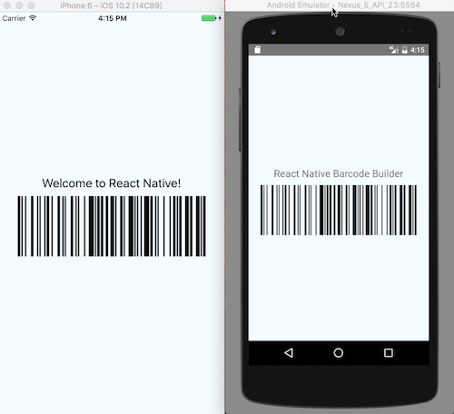

# react-native-barcode-svg

React Native component to generate barcode, without display text/value.

Uses [JsBarcode](https://github.com/lindell/JsBarcode) for encoding of data.

Uses [@react-native-community/react-native-svg](https://github.com/react-native-community/react-native-svg) instead of [@react-native-community/art](https://github.com/react-native-community/art).

## Getting started

### Step 1

Install `react-native-barcode-svg` and dependencies:

    npm install react-native-barcode-svg react-native-svg
    yarn add react-native-barcode-svg react-native-svg

### Step 2

Start using the component

```javascript
import Barcode from 'react-native-barcode-svg';

<Barcode value="Hello World" format="CODE128" />;
```

### Supported formats:

You can find more info about the supported barcode formats (EG.: CODE128, EAN13, EAN8, UPC, ITF, ...) in the:  
[JsBarcode README](https://github.com/lindell/JsBarcode#supported-barcodes)  
[JsBarcode Barcode Generator](https://lindell.me/JsBarcode/generator/)



## Properties

<table style="width:80%">
  <tr>
    <th>Property</th>
    <th>Description</th>
  </tr>
  <tr>
    <td><code>value</code></td>
    <td>What the barcode stands for (required).</td>
  </tr>
  <tr>
    <td><code>format</code></td>
    <td>Which barcode type to use (default: CODE128). https://github.com/lindell/JsBarcode/blob/master/src/barcodes/index.js</td>
  </tr>
  <tr>
    <td><code>singleBarWidth</code></td>
    <td>Width of a single bar (default: 2)</td>
  </tr>
  <tr>
    <td><code>maxWidth</code></td>
    <td>Max-width of the barcode (default: undefined, no-limitation)</td>
  </tr>
  <tr>
    <td><code>height</code></td>
    <td>Height of the barcode (default: 100)</td>
  </tr>
  <tr>
    <td><code>lineColor</code></td>
    <td>Color of the bars and text (default: #000000)</td>
  </tr>
  <tr>
    <td><code>backgroundColor</code></td>
    <td>Background color of the barcode (default: #FFFFFF)</td>
  </tr>
  <tr>
    <td><code>onError</code></td>
    <td>Handler for invalid barcode of selected format</td>
  </tr>
</table>
